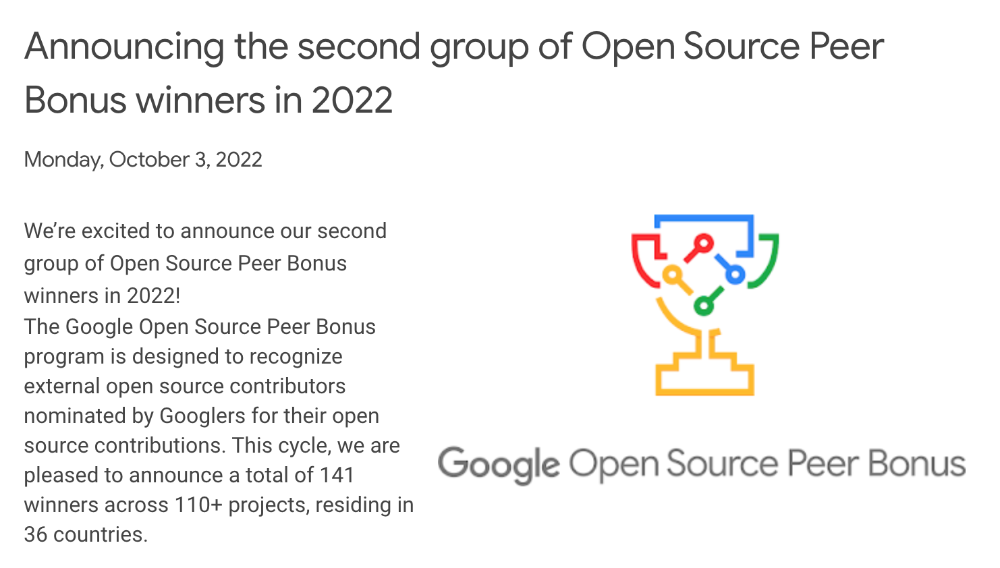

오랜만에 한 해 회고를 남긴다.

개인적으로 오픈소스 프로젝트 활동, 컨퍼런스 발표가 엄청 큰 이벤트였고, 성장할 수 있는 기회가 됐다.

### 오픈소스 프로젝트 활동

3년 만에 Chromium 프로젝트 컨트리뷰션을 다시 시작했다. 2018년부터 2019년 초까지 committer 를 목표로 달리다가 결국 목표를 달성하지 못하고 부서를 옮기면서 그만 뒀었다. 오픈소스 컨트리뷰션을 그만 뒀다가 다시 시작하는 건 어려우면서 두려운 일인데 봄에 그 어려운 걸 이겨낼 수 있는 동기가 생겨 다시 시작할 수 있었다. 6월부터 5개월 간 주로 Web Authentication W3C 스펙과 관련한 수정을 했다. 11월에는 컨퍼런스 발표 준비, 코로나 감염으로 고생하면서 쉬었고 12월까지 아무런 패치를 하지 못 했다. 올해 반영한 패치 수는 10개. 6월에 다시 시작하면서 올해 목표를 committer 로 잡았었는데 결국 달성하지 못 했다. 개인적인 기준으로는 아주 조금만 더 반영하면 가능할 것 같은데 그게 너무 어렵다. 다시 힘을 내서 2023년 1분기 안에 committer nomination 요청을 해 볼 계획이다.

오픈소스 컨트리뷰션을 하면서 기대하지 않았던 두 개의 보상이 있었다.

하나는 구글에서 구글이 주도하는 오픈소스 프로젝트에 기여한 외부 개발자에게 상과 상금을 주는 Open Source Peer Bonus 프로그램의 Winner 로 선정된 것이었다.

> The Google Open Source Peer Bonus program is designed to recognize external open source contributors nominated by Googlers for their open source contributions. This cycle, we are pleased to announce a total of 141 winners across 110+ projects, residing in 36 countries.

[Announcing the second group of Open Source Peer Bonus winners in 2022 | Google Open Source Blog](https://opensource.googleblog.com/2022/09/announcing-the-second-group-of-open-source-peer-bonus-winners-in-2022.html)

아무도 신경쓰지 않던 오래 된 이슈를 맡아 관련 W3C Spec 과 Web Platform Tests 를 직간접적으로 정리하게 되었는데 구글 리뷰어가 이를 좋게 보고 추천해준 것이었다.
상장 문서와 함께 250 달러를 상금으로 받았다.

다른 하나는 회사에서도 오픈소스 컨트리뷰션에 대한 보상을 받은 일이다. 최근 1~2년 사이에 회사에서 오픈소스 개발자를 대우해주려는 몇 가지 보상 제도가 생겼다. 가을에도 하나가 생겼는데 조건이 딱 맞아 보상을 받을 수 있었다. 이걸 기대하고 시작한 건 아니었는데 운이 좋았다.

### 컨퍼런스 발표

회사 컨퍼런스에서 발표를 했다. 타의 반, 자의 반으로 하게 됐다. 막상 발표를 준비해보니 고려해야할 것이 너무 많았다. 나 혼자 한 일이 아니라 많은 사람들이 다 같이 한 일을 회사와 부서를 대표해서 발표하는 것이 정말 큰 부담이었다. 특히 내가 잘 모르는 기술에 대한 내용과 저작권, 초상권, 기술 공개 범위를 고려하여 자료를 만드는 것이 가장 큰 스트레스였다.

처음에는 모든 것이 막막해서 발표 준비를 시작하는 데까지도 시간이 많이 걸렸다. 고민을 하다가 발표 자료를 글로 먼저 썼는데 이게 크게 도움이 됐다. 개요를 짜고 설명을 완성된 문장으로 풀면서 흐름을 정리했다. 보통 러프하게 글을 써 놓으면 ppt 슬라이드도 미완성 형태로 옮기게 되는데, 최대한 완성된 형태의 글을 적어놓았더니 슬라이드도 하나하나 금방 완성할 수 있었다. 본격적으로 ppt 를 만들기 전에는 작성한 마크다운 문서를 GitHub PR 로 올리고 관련 부서원들에게 리뷰를 먼저 받았다. ppt 를 만들기 전에 글로 발표 방향과 내용에 대한 피드백을 먼저 받으면, ppt 형태로 처음 피드백을 받았을 때보다 쉽게 피드백을 반영하고 정리할 수 있는 장점이 있다. 물론 이렇게 해도 발표 리허설 등을 하면서 받은 피드백을 반영하기 위해 발표 자료를 수정할 일이 생긴다.

발표를 준비하면서 발표 내용을 컨퍼런스와 관련이 없는 다른 매체에 글 형태로 외부 공개를 하도록 요청을 받았다. 발표 준비를 하면서 작성해놓은 글이 있었기 때문에 조금만 수정하고 바로 외부 페이지에 배포를 할 수 있었다. 조회수는 1,000회 정도 나왔는데 같은 페이지의 다른 주제에 비해서는 높게 나온 편이라 뿌듯하다.

발표는 배정받은 시간이 오후 늦은 시간이기도 했고 개발 컨퍼런스에서 관심도가 높은 주제가 아니었기 때문에 생각한 것보다 청중은 많지 않았다. 그래도 긴장을 해서 모니터를 보고 스크립트를 읽으면서 발표를 했다. 아직은 발표 영상을 다시 보고 분석할 용기가 나지 않는다. 아마 다음에 이런 기회가 또 생기면 준비를 위해 볼 수 있지 않을까.

### 회사

9년차, 부서를 이 쪽으로 옮긴지는 이제 만으로 3년이 되어 간다. 이 곳의 업무와 업무 프로세스는 아직도 어렵다. 고민을 많이 하고 있다. 여전히 효율적으로 일하는 방법을 찾기 위해 노력하고 있다. 갈수록 문서화에 대한 중요성을 느끼고 있다. 자체적인 프로세스라도 만들어서 문서화와 자동화를 하고 불필요한 업무를 줄여 업무에 집중하고 재미있게 일하기 위해 노력하려고 한다.
