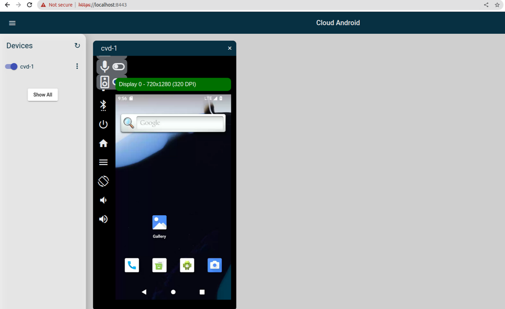

## 개요

Ubuntu 20.04 환경에서 Android 13 버전 기준으로 AOSP 빌드를 하고 Cuttlefish 라는 가상 디바이스에서 실행하는 방법을 정리해보았다.

## AOSP?

보통 Android Open Source Project 를 줄여서 AOSP 라고 부른다. 모바일 기기에 탑재되는 Android OS 는 보통 AOSP에 비공개 코드로 빌드된 여러 모듈과 레이어 + 구글 서비스 + 단말 업체의 수정, 앱, 서비스 등이 포함되어있다고 보면 된다.

AOSP는 오픈소스 프로젝트지만 개발 프로세스, 문서, 코드가 투명하게 모두 공개되어있는 커뮤니티 기반의 일반적인 오픈소스 프로젝트라고 보기는 어렵다. 공개된 repository 에 코드 반영이 가능하긴 하지만 대부분 보수적으로 운영되기 때문에 적극적인 contribution 이 쉽지 않다. AOSP gerrit 에 코드를 올릴 때  CI 빌드가 돌기는 하지만 결과 링크는 구글 내부 URL 이라서 접속을 할 수 없다. 구글이 내부적으로 신규 OS 개발을 1년동안 진행하고 정식 릴리즈 때에 AOSP 브랜치로 전체 merge 를 하는 방식으로 코드를 공개한다.

안드로이드 앱 개발자는 [developer.android.com](https://developer.android.com/) 웹사이트가 익숙한데 AOSP는 이 곳이 아닌 별도의 [source.android.com](https://source.android.com) 사이트에 플랫폼 개발자를 위한 문서를 제공한다. developer 사이트에 비해 내용이 많이 부족했지만 몇 년 사이에 리뉴얼도 하고 최신 내용도 많이 보충되었다.

## Cuttlefish?

Cuttlefish 는 에뮬레이터와 비슷한 가상 환경의 안드로이드 디바이스 이름이다. (Cuttlefish 뜻은 갑오징어이다. 이 때문에 한국어 AOSP 사이트에는 '오징어 가상 Android 기기'로 이상하게 번역되어 있다.) 아래 링크에 에뮬레이터와의 차이점이 설명되어있다. 기존 에뮬레이터는 앱 개발을 쉽게 하기 위한 용도로 기능적으로 앱이 잘 실행될 수 있도록 후킹이 되어있는 부분이 있어서 플랫폼/프레임워크에 대한 적합성을 100% 보장하지 않는다고 한다. 반면 Cuttlefish 는 CTS(Compatibility Test Suite) 등을 돌릴 수 있을 정도로 HAL(Hardware Abstraction Layer)을 제외하면 실제 기기와 거의 동일한 순수 AOSP 플랫폼/프레임워크 기반의 디바이스라고 한다. AOSP 의 대표 공식 가상 환경으로 설명되어있다.

[https://source.android.com/docs/setup/create/cuttlefish](https://source.android.com/docs/setup/create/cuttlefish)

Cuttlefish 는 기본적으로 웹 환경으로 제공된다. 웹페이지에 접속하여 기기를 실행한다. 로컬 환경에서 AOSP 코드를 빌드해서 직접 구동을 할 수도 있고 빌드된 이미지를 로컬 환경이나 클라우드 환경에서 구동할 수도 있다. 직접 돌려봤을 때는 에뮬레이터 대비 가벼운 느낌도 좀 있었다.

## AOSP 빌드 방법

### 빌드 환경

빌드 환경 셋업은 아래 링크에 나와있는 그대로 따라했다. Ubuntu 20.04 를 사용하고 있는데 아래 링크에서 Ubuntu 18.04 와 동일하게 패키지를 설치하였는데 별 다른 문제는 없었다.

[https://source.android.com/docs/setup/start/initializing](https://source.android.com/docs/setup/start/initializing)

### 소스 다운로드 및 빌드

```bash
$ mkdir AOSP
$ cd AOSP
$ repo init --depth=1 -u https://android.googlesource.com/platform/manifest -b android13-gsi
$ repo sync -c --no-clone-bundle --no-tags -j$(nproc --all)
$ . build/envsetup.sh
$ lunch aosp_cf_arm64_phone
$ m
```

repo 는 빌드 환경을 위한 도구이다. AOSP 는 수십개의 repository 로 구성되어있으며 manifest 로 이를 관리한다. master 브랜치는 개발 중인 브랜치로 빌드나 디바이스 실행 등이 잘 안 될 수 있기 때문에 Android 13 의 안정화 버전이라고 할 수 있는 Generic System Image 를 위한 android13-gsi 태그로 코드를 받았다. 소스 싱크는 1~2시간 가량 걸렸다.

프로젝트가 워낙 크기 때문에 전체 git history 를 포함한 코드를 모두 받으면 디스크 용량이 부족할 수 있다. 다운받을 소스 코드를 최소화하기 위해 repo init, sync 시에 --depth=1, -c, --no-clone-bundle, --no-tags 옵션 등을 추가했다. 코드는 빌드로만 사용하고 히스토리 트래킹은 [https://cs.android.com](https://cs.android.com) 이나 [https://android.googlesource.com/](https://android.googlesource.com/) 를 참고하는 것이 낫다. 만약 contribution 이 필요한 경우 관련 project 만 따로 코드를 받는 것이 좋다.

`repo init --help`, `repo sync --help` 를 하면 사용할 수 있는 옵션을 볼 수 있다.

`. build/envsetup.sh` 으로 `PATH` 등의 빌드 환경을 잡고 `lunch` 명령어로 디바이스 타겟을 설정하여 빌드 준비를 한다. Cuttlefish 타겟을 위해 aosp_cf_arm64_phone 디바이스를 타겟으로 했다. `lunch` 명령어를 실행하면 아래와 같은 결과가 나온다.

```
============================================
PLATFORM_VERSION_CODENAME=REL
PLATFORM_VERSION=13
TARGET_PRODUCT=aosp_cf_x86_64_phone
TARGET_BUILD_VARIANT=eng
TARGET_BUILD_TYPE=release
TARGET_ARCH=x86_64
TARGET_ARCH_VARIANT=silvermont
TARGET_2ND_ARCH=x86
TARGET_2ND_ARCH_VARIANT=silvermont
HOST_ARCH=x86_64
HOST_2ND_ARCH=x86
HOST_OS=linux
HOST_OS_EXTRA=Linux-5.15.0-67-generic-x86_64-Ubuntu-20.04.4-LTS
HOST_CROSS_OS=windows
HOST_CROSS_ARCH=x86
HOST_CROSS_2ND_ARCH=x86_64
HOST_BUILD_TYPE=release
BUILD_ID=TP1A.220624.019
OUT_DIR=out
PRODUCT_SOONG_NAMESPACES=device/generic/goldfish-opengl device/generic/goldfish device/generic/goldfish-opengl hardware/google/camera hardware/google/camera/devices/EmulatedCamera device/google/cuttlefish/apex/com.google.cf.wifi_hwsim external/mesa3d vendor/google_devices/common/proprietary/confirmatioui_hal
============================================
```

마지막으로 m 명령어로 전체 빌드를 한다.

- https://source.android.com/docs/setup/download/downloading
- https://source.android.com/docs/setup/build/building

### 빌드 에러

빌드 에러가 간간히 발생했는데 무시하고 다시 m 명령어로 빌드를 몇 번 재시도했더니 결국 전체 소스 빌드에 성공했다. 빌드는 3~4시간은 걸린 걸로 기억한다.

1. rust 에서 빌드 중 segmentation fault 발생

```
[ 87% 161402/183718] //packages/modules/Virtualization/compos:compsvc rustc src/compsvc_main.rs [apex10000]
FAILED: out/soong/.intermediates/packages/modules/Virtualization/compos/compsvc/android_arm64_armv8-a_cortex-a53_apex10000/unstripped/compsvc
```

2. R8 에러

```
Error: java.lang.ClassCastException: class co m.android.tools.r8.graph.i1$g cannot be cast to class co[m.android.tools.r8.graph.o0](http://m.android.tools.r8.graph.o0) (co m.android.tools.r8.graph.i1$g and co[m.android.tools.r8.graph.o0](http://m.android.tools.r8.graph.o0) are in unnamed 
module of loader 'app')
Compilation failed with an internal error.
```

## Cuttlefish 실행

https://source.android.com/docs/setup/create/cuttlefish-use

위 링크를 참고하여 Cuttlefish 를 설치했다.

```bash
$ sudo apt install -y git devscripts config-package-dev debhelper-compat golang curl
$ git clone https://github.com/google/android-cuttlefish
$ cd android-cuttlefish
$ for dir in base frontend; do
  cd $dir
  debuild -i -us -uc -b -d
  cd ..
done
$ sudo dpkg -i ./cuttlefish-base_*_*64.deb || sudo apt-get install -f
$ sudo dpkg -i ./cuttlefish-user_*_*64.deb || sudo apt-get install -f
$ sudo usermod -aG kvm,cvdnetwork,render $USER
$ sudo reboot
```

재부팅을 하면 빌드할 때 실행했던 `build/envsetup.sh` 로 지정된 `PATH`가 다 날아가므로 다시 실행을 해줘야 한다. (터미널을 새로 실행하거나 새 탭을 열 때도 마찬가지)

```bash
$ cd AOSP
$ . build/envsetup.sh
$ lunch aosp_cf_arm64_phone
# 실행
$ launch_cvd --daemon
# 종료
$ stop_cvd
```

`launch_cvd` 를 실행한 뒤 https://localhost:8443 에 접속하여 Devices 밑에 cvd-1 이 뜨는지 확인한다. 토글 버튼을 눌러 cvd-1 을 실행하면 디바이스가 부팅이 된다.


_<center>부팅된 Cuttlefish 화면</center>_

`launch_cvd` 를 실행했을 때 정상적인 경우 아래처럼 로그가 나오고

```
$ launch_cvd --daemon
===================================================================
NOTICE:

We collect usage statistics in accordance with our
Content Licenses (https://source.android.com/setup/start/licenses),
Contributor License Agreement (https://cla.developers.google.com/),
Privacy Policy (https://policies.google.com/privacy) and
Terms of Service (https://policies.google.com/terms).
===================================================================

launch_cvd I 03-19 00:29:01 75269 75269 main.cc:186] Host changed from last run: 0
assemble_cvd D 03-19 00:29:01 75657 75657 fetcher_config.cpp:212] Could not find file ending in kernel
assemble_cvd D 03-19 00:29:01 75657 75657 fetcher_config.cpp:212] Could not find file ending in initramfs.img
assemble_cvd I 03-19 00:29:01 75657 75657 config_flag.cpp:148] Launching CVD using --config='phone'.
assemble_cvd D 03-19 00:29:01 75657 75657 subprocess.cpp:335] Started (pid: 75660): /home/amoseui/Workspace/AOSP/out/host/linux-x86/bin/extract-ikconfig
assemble_cvd D 03-19 00:29:01 75657 75657 subprocess.cpp:337] /home/amoseui/Workspace/AOSP/out/target/product/vsoc_x86_64/boot.img
GPU auto mode: did not detect prerequisites for accelerated rendering support, enabling --gpu_mode=guest_swiftshader.
The following files contain useful debugging information:
  Serial console is disabled; use -console=true to enable it.
  Kernel log: /home/amoseui/cuttlefish/instances/cvd-1/kernel.log
  Logcat output: /home/amoseui/cuttlefish/instances/cvd-1/logs/logcat
  Launcher log: /home/amoseui/cuttlefish/instances/cvd-1/logs/launcher.log
  Instance configuration: /home/amoseui/cuttlefish/instances/cvd-1/cuttlefish_config.json
  Instance environment: /home/amoseui/.cuttlefish.sh
```

cvd-1 을 켜서 부팅에 성공하면 아래 로그까지 나온다.

```
Virtual device booted successfully
VIRTUAL_DEVICE_BOOT_COMPLETED
```

부팅이 안 되는 경우에는 `kernel.log` 나 `launcher.log` 의 내용을 확인해야 한다.

```
The following files contain useful debugging information:
  Serial console is disabled; use -console=true to enable it.
  Kernel log: /home/amoseui/cuttlefish/instances/cvd-1/kernel.log
  Logcat output: /home/amoseui/cuttlefish/instances/cvd-1/logs/logcat
  Launcher log: /home/amoseui/cuttlefish/instances/cvd-1/logs/launcher.log
  Instance configuration: /home/amoseui/cuttlefish/instances/cvd-1/cuttlefish_config.json
  Instance environment: /home/amoseui/.cuttlefish.sh
```

`launcher.log` 내용을 확인해보니 아래처럼 kvm (kernel-based virtual machine) 경로가 없다는 에러가 있었다.

```
run_cvd D 03-14 21:12:36 3458590 3458590 subprocess.cpp:337] /home/amoseui/Workspace/AOSP/out/target/product/vsoc_x86_64/bootloader
openwrt D 03-14 21:12:36 3458613 3458613 log_tee.cpp:75] `--seccomp-policy-dir=/home/amoseui/Workspace/AOSP/out/host/linux-x86/usr/share/cuttlefish/x86_64-linux-gnu/seccomp` is deprecated, please use `--seccomp-policy-dir /home/amoseui/Workspace/AOSP/out/host/linux-x86/usr/share/cuttlefish/x86_64-linux-gnu/seccomp`
openwrt D 03-14 21:12:36 3458613 3458613 log_tee.cpp:75] [2023-03-14T21:12:36.663845565+09:00 ERROR crosvm] kvm path "/dev/kvm" does not exist
run_cvd I 03-14 21:12:36 3458590 3458590 process_monitor.cc:118] Detected unexpected exit of monitored subprocess /home/amoseui/Workspace/AOSP/out/host/linux-x86/bin/crosvm
run_cvd I 03-14 21:12:36 3458590 3458590 process_monitor.cc:120] Subprocess /home/amoseui/Workspace/AOSP/out/host/linux-x86/bin/crosvm (3458640) has exited with exit code 1
```

`sudo kvm-ok` 로 kvm 을 확인해보았더니 BIOS 에서 disable 되어있어서 안된다는 메시지를 나왔다.

```bash
$ sudo kvm-ok
INFO: /dev/kvm does not exist
HINT:   sudo modprobe kvm_amd
INFO: Your CPU supports KVM extensions
INFO: KVM (svm) is disabled by your BIOS
HINT: Enter your BIOS setup and enable Virtualization Technology (VT),
      and then hard poweroff/poweron your system
KVM acceleration can NOT be used
```

AMD 라이젠 GIGABYTE 기준, 부팅 화면에서 BIOS 설정으로 들어가서
M.I.T > Advanced Frequency Settings > Advanced CPU Core Settings > SVM Mode 을 enable 한 뒤,
아래 명령어를 실행하다보니 부팅이 됐다. (바로 기록한 것이 아니라 순서나 내용이 정확하지 않을 수 있음)

```bash
$ sudo modprobe kvm_amd
$ sudo apt install -y qemu qemu-kvm libvirt-daemon libvirt-clients bridge-utils virt-manager
$ ls -al /dev/kvm
$ sudo usermod -aG kvm,cvdnetwork,render $USER
$ sudo kvm-ok
INFO: /dev/kvm exists
KVM acceleration can be used
```
