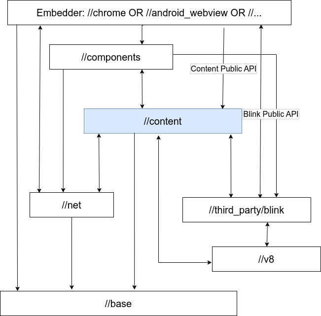

### 관련 링크

- 제목: webauthn: Remove java tests DEPS exceptions for ClientDataJsonImpl
- 패치: https://chromium-review.googlesource.com/c/chromium/src/+/4622851
- 버그
  - https://bugs.chromium.org/p/chromium/issues/detail?id=1445544

### 개요

Chromium 프로젝트의 content 모듈은 사실상 웹 브라우저의 본체와 같다. content 모듈에서 Chrome 의 자체 기능을 구현하거나 UI 를 활용한 부분을 제외한 전반적인 멀티프로세스 브라우저 기능을 담당한다. content 레이어까지만 포함하여 기본적인 브라우저 기능을 제공하는 Content Shell 이라는 앱을 빌드할 수도 있다. chrome 이나 android_webview 등의 content 를 사용하는 모듈은 content/public 폴더에 있는 public API 를 통해 content 모듈에 접근하도록 설계되어있다. Android 를 위한 Java 파일의 경우 content_public 과 같은 package 명으로 구분을 하기도 한다.



- 출처: https://chromium.googlesource.com/chromium/src/+/HEAD/content/README.md
- 참고: https://chromium.googlesource.com/chromium/src/+/HEAD/content/public/README.md

이런 각 레이어, 모듈 간의 종속성은 폴더마다 DEPS 파일로 관리한다. 이 파일에 선언한 내용을 위반하면 빌드가 불가능하다. 테스트나 어쩔 수 없는 특별한 경우에는 예외 처리를 하기도 한다.

### 내용

webauthn 의 안드로이드 테스트 코드에서 content 에 구현되어있는 `ClientDataJsonImpl` 클래스를 mocking 하여 사용하는 경우가 있다. 원칙적으로 `ClientDataJson` 클래스는 public 이고 ClientDataJsonImpl 은 그 구현체이기 때문에 chrome 레이어에서는 `ClientDataJson` 을 사용하고 `ClientDataJsonImpl` 에는 접근을 하면 안 된다. 하지만 테스트 코드에서는 `ClientDataJsonImpl` 을 예외처리하여 직접 사용하고 있다.

- `ClientDataJson` 의 위치 : content/public/android/java/src/org/chromium/content_public/browser/ClientDataJson.java
- `ClinetDataJsonImpl` 의 위치 : content/public/android/java/src/org/chromium/content/browser/ClientDataJsonImpl.java

chrome/android/junit/DEPS 파일에는 `ClientDataJsonImpl` 파일에 대한 예외 처리가 되어있다.

```
specific_include_rules = {
  # Added to allow tests to mock JNI methods within the implementation. Tests
  # use the public API classes where possible.
  "Fido2CredentialRequestRobolectricTest.java": [
    "+content/public/android/java/src/org/chromium/content/browser/ClientDataJsonImpl.java",
  ]
}
```

이처럼 DEPS 에 예외처리가 되어있고 `Fido2CredentialRequestRobolectricTest` 에서 `ClientDataJsonImpl` 을 import 하고 있지만 실제로는 사용하지 않고 있기 때문에 불필요한 코드를 삭제하고 DEPS 에서도 삭제했다.

### 후기

Chrome Android instrumentation 테스트를 하는 javatest 모듈에도 예외처리가 되어있다. (위치: chrome/android/javatests/DEPS) 여기서는 실제로 테스트 코드에서 `ClientDataJsonImpl` 를 사용하고 있어 DEPS 내 예외처리 삭제와 레이어 종속성 규칙을 지키기 위한 코드 수정이 함께 필요하다. 이전에 시도를 해보다가 적절한 답을 못 찾았는데 다음에 다시 한 번 도전해볼 생각이다.
