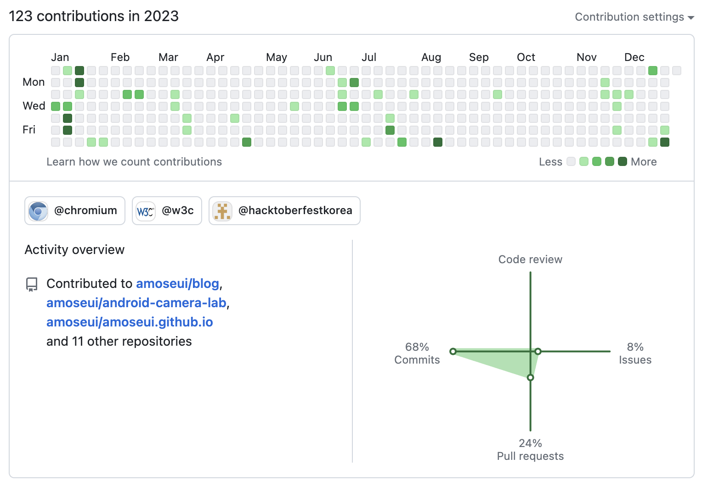
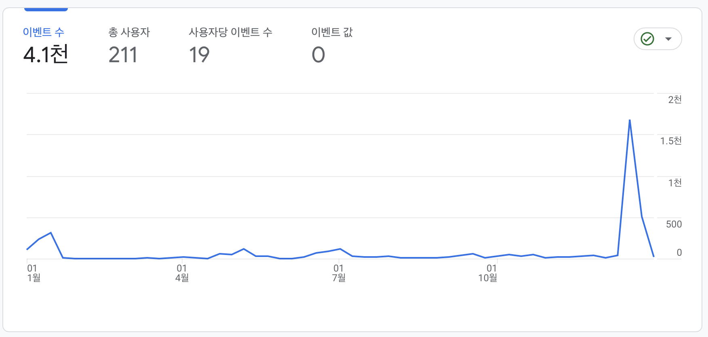
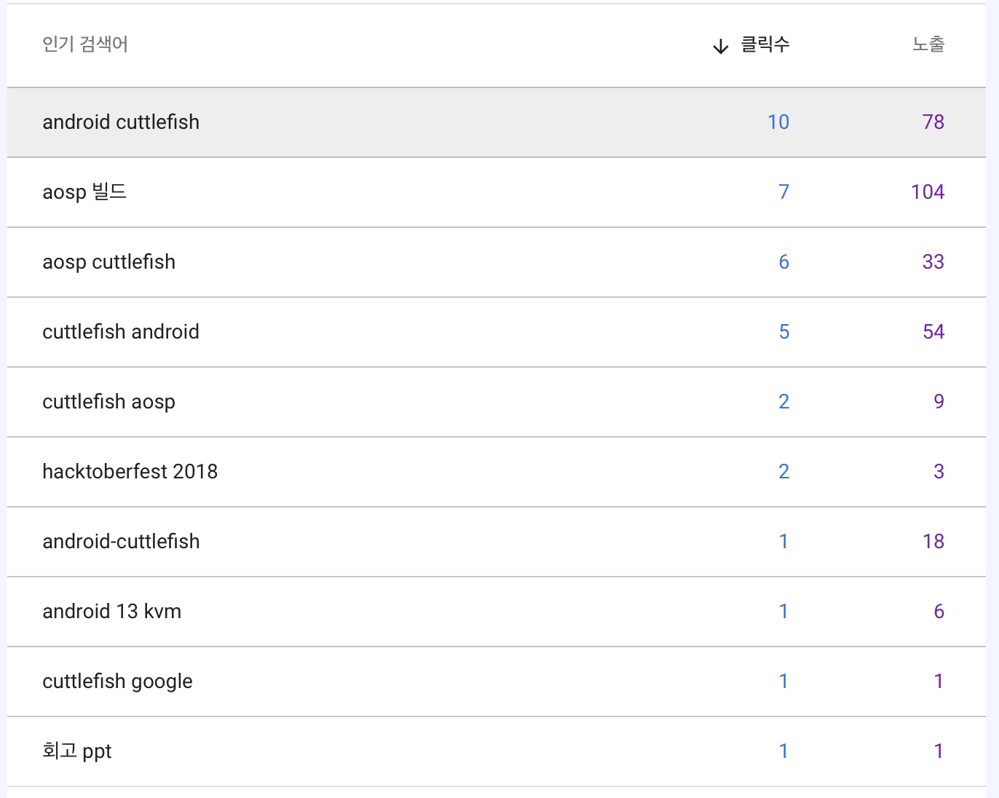

### 회사

11월에 팀을 옮겼다. 특이한 부서의 인원 모집 공고가 떴는데 마침 예전에 있던 팀에서 알던 분이 계셔서 먼저 연락을 드렸고, 감사하게도 뽑아주셨다. 이전 팀은 우리 회사의 핵심 부서 중 하나이고 아주 큰 조직이었다. 3년 6개월 동안 많이 배우기도 했지만 힘든 점도 많았다. 내외적으로 여러 종류의 스트레스가 있었다. 스스로 해결하기 어려운 어쩔 수 없는 문제가 많았다. 정신적으로 지쳐서 그런지 내적인 문제도 계속 쌓였다. 결국 환경을 바꿔주면 조금이라도 해소가 될 수 있을거라고 믿었다. 이런저런 고민이 많을 때에 좋은 기회가 있어서 옮겼다. 회사가 크다 보니 팀을 옮기는게 이직하는 것과 비슷한 효과를 주는 것 같다.

나오면서 이전 부서에서 경험한 일과 조직에 대한 복기를 해봐야겠다고 생각했는데 아직 정리를 못했다. 더 늦기 전에 정리를 해두려고 한다. 분명 배운 점도 많이 있었다. 그동안 배운 것과 고민했던 것이 새로 온 부서에서 적응하는데 도움이 되고 있다. 이전 부서에 생각보다 길게 있었기 때문에 더 큰 스트레스를 받았던 것 같기도 한데, 이 정도 있었기에 알게 된 것도 많다.

이제 이 회사에서 일을 시작한지 만으로 10년이 되었다. 그동안 자의로 팀을 세 번 옮겨서 이번이 네번째 팀이다. 그동안 거쳐 온 부서들의 성격이 각각 달랐었는데 이번 팀은 또 완전 다르다. 선행 조직이고 다양한 직군이 있다보니 지금까지 경험해보지 못한 업무 목표, 방향, 관점을 갖고 있다. 팀이 작다보니 개인적인 역할도 더 생겼다. 리더는 아니지만 주니어 양성에도 좀 더 신경을 써야 한다. 예전보다는 나를 좀 더 돌아보고 주변도 함께 돌아볼 수 있는 여유가 생겼기에 많은 걸 시도해보고 배울 수 있기를 기대하고 있다.

### 오픈소스

작년에 다시 시작했던 Chromium 기여 활동을 잠깐 쉬다가 오픈 프런티어 활동을 하면서 조금씩 패치를 반영했다. 회사에서도 오픈소스에 관심 있는 분들 대상으로 멘토링을 했다. 회사에서 갑자기 멘토링 프로그램을 시작하였고 별 다른 가이드없이 멘토에게 자율적으로 멘토링을 맡겼다. 멘토링이 처음이었기 때문에 준비해둔 자료가 없었다. 이 프로그램을 위해서 새로 무언가를 만드는 건 부담되는 일이었다. 멘티는 두 명이었는데 간단한 세미나 한 번, 식사 몇 차례와 티타임을 가졌다. 한 분은 현업과 관련이 크게 없는 프로젝트였음에도 몇 차례 패치를 반영했다. 좀 더 준비가 되어있었으면 서로 좋았을텐데 아쉽다. 평소에 정리와 문서화를 잘 해두어야겠다는 생각을 했다.

그동안 오픈소스에 관심을 갖고 직접 기여를 하면서 많이 배웠다. 2024년에는 1. Chromium 기여를 좀 더 해서 committer 가 되는 것, 2. 다른 오픈소스 프로젝트를 선택해서 꾸준히 기여하는 것, 3. 내 프로젝트를 오픈소스 프로젝트 형식으로 개발하여 플레이스토어에 출시하는 것을 목표로 세웠다.

### 스터디

2개의 스터디를 해봤지만 큰 성과는 없었다. 하나는 AOSP 스터디였다. 온라인에서 스터디 인원을 모집하는 글을 보고 신청했다. 스터디 그룹 인원은 4~5명 정도 됐는데 각자 업무가 다르고 목표가 달랐다. 너무 광범위한 주제였고 스터디를 진행하기에 적절한 도서나 레퍼런스가 없었다. 온라인 스터디 8회, 오프라인 모임 1회를 하고 마무리했다. 현재 국내에서 AOSP 에 관심을 갖고 블로그에 자료를 꾸준히 올리는 사람이 거의 없다. 스터디를 하면서 다른 회사에서 AOSP 관련 현업을 하면서 관심을 갖고 있는 개발자들을 만나서 좋았는데 이 기회를 발전시키지 못한게 아쉽다. 다른 스터디 하나는 Chromium contribution 을 하면서 부족한 부분을 채우고자 예전 부서 분들과 C++ 스터디를 해봤는데 이것도 잘 안 됐다. 제대로 된 스터디를 경험해본 적이 없어서 그런지 아직까지는 스터디 그룹으로 공부하는 방식이 잘 안 맞는 것 같다. 이외에 Chromium contribution 을 하는 국내 개발자들을 모아서 했던 '오픈소스를 하는 사람들'이라는 모임에도 참여했었다. 매주 일요일 밤 10시에 온라인으로 모여서 인사하고 각자 개발하는 시간을 가졌다. 이것도 어느 순간 흐지부지되면서 하반기부터는 모임 진행이 잘 안 됐던 것 같다. 올해는 스터디보다는 차라리 온라인 강의 수강을 시도해보려고 한다. 집에 있는 책도 많이 읽어야겠다.

### 블로그

2023년에는 이 블로그에 8개의 글을 올렸다. Chromium 에 반영한 내용을 정리해서 올리기 시작했다. 블로그에 올리면서 좀 더 정리를 하게 되는 효과가 있어 2024년에도 같은 방식으로 글을 올리려고 한다. 2023년 초에 velog, 티스토리를 따로 만들어서 조금씩 올렸는데 흐지부지됐다. velog 에는 간단한 TIL(Today I Learned) 을 올리고 티스토리에는 책, 강의, 레퍼런스 등을 정리하는 글을 올리려고 한다.

중국 개발자가 내 Google Analytics ID 를 삭제하지 않은 채로 내 블로그 repo 를 그대로 갖다 썼다. 이 사실을 알게 되어 내가 해당 repo 에서 ID 를 직접 삭제하기 전까지 며칠동안 그 블로그가 추적되었다. 조회수가 너무 확 튀어버렸다.

다음은 검색어 순위. aosp cuttlefish 관련 검색어가 많다. 검색어 노출 순위도 나름 높은 편이다.

### 2024년

2024년 한 해의 목표를 `Pay Off` 로 정했다. 밀린 부채를 갚는 것이다. 아주 예전부터 매년 계획을 세웠지만 달성하지 못한 적이 훨씬 많았다. 잊고 살다가도 다시 또 비슷한 계획을 세우고 시도하려고 한다. 위에 작성한 오픈소스 활동이라던지, 앱 출시, 블로그 관리 같은 일들은 대학생 때부터 생각하고 여러 방식으로 계획을 세웠던 일이지만 지금까지 제대로 마무리한 적이 없다. 10년 동안 일을 하면서 쌓인 기술 부채와 미뤄두었던 여러 목표를 갚을 수 있는 해가 되길 바란다. 부족한 부분을 채우고 다시 나아갈 수 있는 힘을 기르고 싶다.
