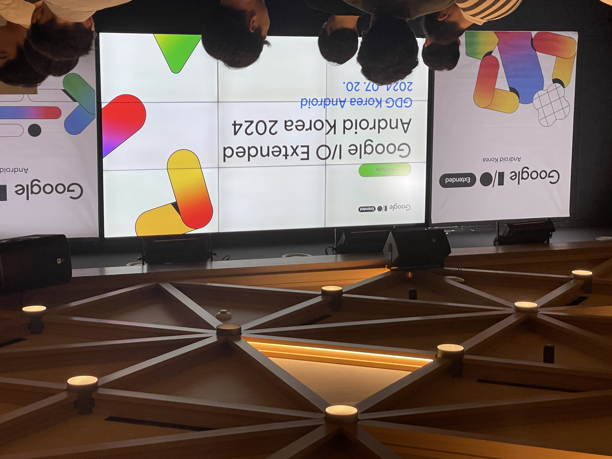

지난 7월 두 개의 GDG Google I/O Extended 에 참석했던 후기를 뒤늦게 올린다.

하나는 7월 20일에 열린 [Extended Android](https://festa.io/events/5509), 다른 하나는 7월 27일에 열린 [Extended 인천/송도](https://festa.io/events/5477) 였다.

GDG 는 Google Developer Group 의 줄임말로 구글과 구글의 기술을 좋아하는 개발자 커뮤니티이다. GDG 운영진은 구글 소속이 아니고, GDG 에서 진행하는 공식 행사는 구글의 후원을 일부 받으면서 운영되는 것으로 알고 있다. 매년 세계 곳곳의 GDG 에서 I/O Extended, DevFest 와 같은 정기 행사를 열고, 때때로 자체적으로 비공식 행사를 개최하기도 한다. 코로나 전에는 GDG 서울과 수원에서 개최했던 DevFest, I/O Extended 행사를 다녀온 적이 있는데 좋은 기억으로 남아있다. (GDG 수원은 코로나 이후로 없어진 것 같다.)

GDG 에서 개최하는 행사는 구글 이름이 걸려 있지만 기업 주도의 컨퍼런스 느낌보다는 보통 개발자 교류를 위한 커뮤니티 성격이 더 강하다. 주니어 때는 이런 개발자 컨퍼런스를 꽤나 다녔는데 어느 순간 회의감이 들어서 코로나 이후로는 거의 가지 않았다. 보통은 내용이 주니어에게 맞춰져 있어서 너무 초보적이고 다 아는 내용이거나, 아니면 한 주제에 너무 집중적으로 들어가서 집중력을 잃고 얻는 것 없이 시간 낭비만 했다는 들었기 때문이다.

그러다 최근에 다시 가고 싶다는 생각이 들었는데,

1. 요즘 너무 놀고만 있다는 생각
2. 젊고 다양한 개발자들의 열기를 느끼고 싶음 (개발자 문화도 트렌드가 있다.)
3. 현장에서 직접 보고 듣는 것이 집중이 잘 됨 (유튜브에 올라온 것은 잘 보지 않게 됨)

와 같이 동기 부여를 받고 싶었기 때문이었다.

특히 GDG 와 같이 커뮤니티 기반의 행사가 기업 주도의 컨퍼런스보다는 상대적으로 조금 더 동기 부여 측면에서 도움이 될 거라는 생각이 들었다. (기업 컨퍼런스는 대부분 추첨이나 선착순이라 경쟁률이 너무 높아 티켓팅이 쉽지 않기도 하다.)

## Google I/O Extended

앞서 언급했듯이 매년 Google I/O 가 끝난 뒤에 여러 GDG 에서 Google I/O Exteneded 를 개최한다. 올해는 안드로이드, 인천/송도, 판교 등에서 I/O Extended 행사를 열었다. 지역 별로 전반적인 내용을 다루는 경우도 있고, 안드로이드, 웹, 머신러닝과 같이 특정 주제로 컨퍼런스를 열기도 한다.

## [안드로이드](https://festa.io/events/5509)

안드로이드의 경우 트랙 하나로 모든 세션이 운영 되었고 각 세션이 Google I/O 에 충실한 느낌. 저녁에 다른 일정이 있어 중간에 나왔지만 안드로이드와 관련된 업무를 하는 입장에서 새로 발표한 내용을 다뤄줘서 좋았다. Google I/O 의 경우 이벤트 키노트와 개발자 키노트가 중요한데 I/O Extended 발표를 통해 이해하게 된 부분이 많았고 정리도 많이 됐다. 모든 세션이 끝나고 네트워킹 타임도 있었는데 참여하지 못했다.

### 수강

- 키노트
- What's new in Android
- What's new in Android development tools
- 유연한 Composable 설계(난 RN 개발자인데)
- 벤치마크 사용설명서(흑마법 아님 주의)

## [인천/송도](https://festa.io/events/5477)

인천/송도는 Google I/O 에 한정짓지 않고 좀 더 개발자 축제 느낌으로 다양한 주제와 발표자를 선정한 느낌이었다. GDG 인천/송도는 코로나 이후로 다른 GDG 에 비해 컨퍼런스를 크게 열고 있는데 이번에도 역시나 발표가 많고 참석 인원도 많아 고민이 많았을 것 같다. 나는 컨퍼런스 참여 목적 첫번째가 동기 부여였기 때문에 General 주제 위주로 많이 들었다. 듣다 보니 피곤해지고 집중력이 너무 떨어져서 나중에는 지인의 발표나 내용이 쉬운 발표 위주로 들었다.

### 수강

- 에어프레미아는 왜 재개발을 하는가?
- 상태관리의 사실과 오해
- 사수 없는 주니어 개발자과 성장하는 방법
- 100명의 개발자분들을 도와 100개 넘는 오픈소스 PR을 함께 만들고 세상을 바꾼 이야기
- Flutter Golden Test 101
- Godot Engine으로 시작하는 1인 게임 개발

## 소감

오랜만에 컨퍼런스에 갔는데 기대한 것처럼 에너지를 많이 얻고 동기 부여를 받아서 돌아왔다. 기술적인 측면에서는 사실 큰 소득은 없었다. 그래도 다양한 사람들의 발표를 보면서 컨퍼런스 발표에 대한 생각도 조금 하게 됐다. 이 때 했던 작은 생각이 이어져서 실제로 11월에 발표를 하나 하게 됐다. 이전보다는 개발자 커뮤니티나 컨퍼런스 등에 조금 더 참여할 생각이다.
