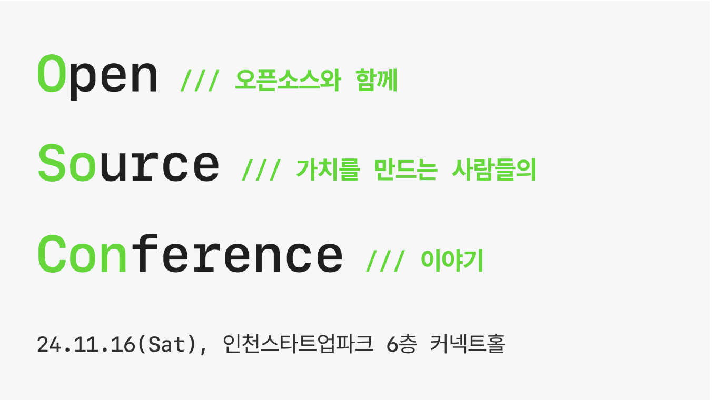
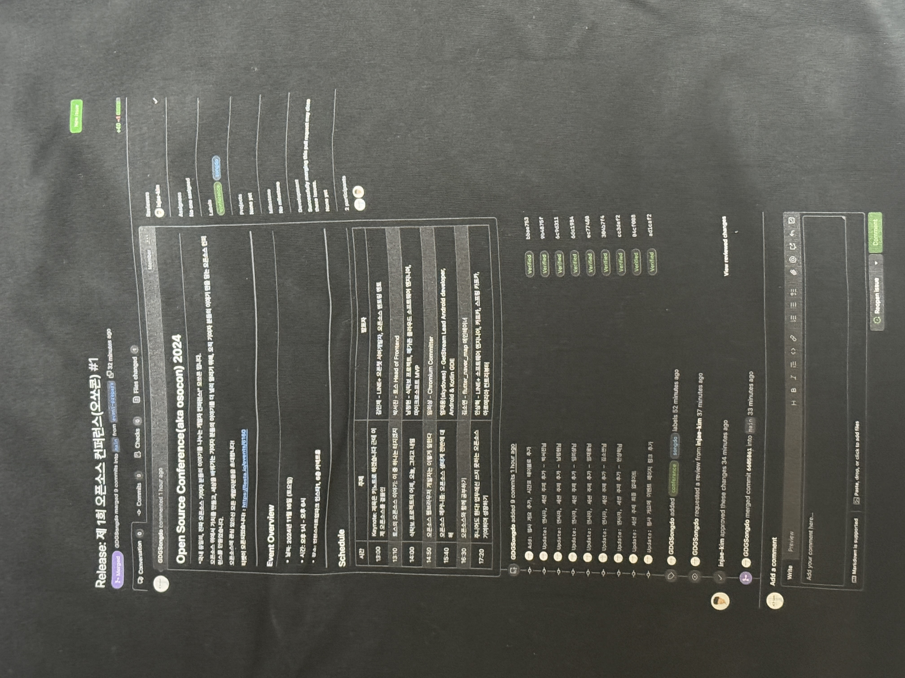

11월 16일 토요일 [Open Source Conference](https://festa.io/events/6160)(오픈소스 컨퍼런스, 줄여서 오쏘콘) 에서 ‘오픈소스 웹 브라우저 개발자는 이렇게 일한다’ 라는 주제로 발표를 했다.

오쏘콘은 올해 처음으로 열린 커뮤니티 기반의 오픈소스 개발자 컨퍼런스이다. 주최는 GDG(Google Developers Group) 송도.

## 발표 제안

섭외는 지난 8월 일본에서 이뤄졌다. 음악 좋아하는 개발자들과 함께 일본 섬머소닉 페스티벌을 다녀왔다. 페스티벌 마지막 날, 뒷풀이까지 하고 숙소로 또 돌아와서 새벽까지 술을 먹다가 GDG Organizer 한 분이 새로운 오픈소스 컨퍼런스를 기획 중이라고 했고, 얘기를 듣자마자 바로 발표를 하겠다고 했다.(새벽 3-4시 쯤..) 올해 몇 년 만에 커뮤니티 기반의 개발자 컨퍼런스를 다녀보면서 나도 발표를 한 번 해보면 좋을 것 같다는 생각을 했고, 생각해 놓은 주제도 몇 개 있어서 바로 하겠다고 했다.

귀국하고 정식으로 다시 연락을 주셨다. 막상 하려니 부담이 돼서 시간을 달라고 했다가 그냥 해야겠다는 생각에 10분 만에 다시 한다고 말씀드렸다.

## 주제 선정

지금까지 개발자 컨퍼런스에서 발표한 경험은 딱 한 번, 회사 컨퍼런스였어서 내가 하고 싶은 얘기보다는 부서를 대표하는 내용의 발표를 했다.(나보다는 리더급이 하는게 더 맞는 내용) 발표 자료도 보안이나 저작권을 신경쓰면서 만들어야 해서 제약이 많았다. 발표 시간도 20-25분이라 보통의 컨퍼런스보다는 짧은 시간이었다. 준비를 열심히 했는데 청중이 생각보다 적어서 살짝 아쉬웠다.

그 아쉬움 때문인지 커뮤니티 기반의 젊고 열정있는 분위기의 컨퍼런스에서 내가 하고 싶은 발표를 한 번 쯤 해보고 싶었다. 내 얘기를 주로 해야 하는 것이 조금 부담이 되지만 그래도 좋은 경험이 될 것 같았다.

발표 제안을 받기 전부터 생각했던 내용은 [구글 엔지니어는 이렇게 일한다](https://product.kyobobook.co.kr/detail/S000061352347) 라는 책을 구글의 오픈소스 프로젝트인 Chromium 버전으로 푸는 것이었다. Chromium 이나 AOSP 에 기여를 해보면서 경험한 걸 책과 비교해서 설명하면 재밌을 거라 생각했다.

#### 주최 측의 컨퍼런스 발표 주제 방향

- 오픈소스 기여자들이 세상을 직접 바꿔가는 이야기
- 오픈소스, 현대 문명의 바퀴를 만들어가는 기여자들의 이야기

내가 오픈소스로 대단한 일을 하고 있다고 생각하지는 않아서 전달받은 문장이 살짝 부담이 되긴 했지만, 발표 주제와 함께 나의 고민과 고충과, 좋았던 점, 아쉬웠던 점은 꼭 공유해야겠다고 생각했다.

#### 준비를 하면서 이루고자 했던 것

1. '구글 엔지니어는 이렇게 일한다' 책 읽기 (나오자 마자 샀었는데 그동안 제대로 읽은 적이 없었음.)
2. 기능 구현을 하면서 Chromium 개발 프로세스를 처음부터 끝까지 직접 경험해보기

3개월 정도 시간이 있었기 때문에 발표를 준비하면서 그동안 같이 해보고 싶었다.

## 발표 준비

막상 준비를 해보니 쉽지 않았다. 목표와 계획을 너무 크게 잡았다. 책 읽는 것과 기능 구현 모두 크게 부담이 됐다. 책 한 권을 읽는 것도 귀찮았고, Feature 하나를 처음부터 개발하고 문서까지 쓰고 할 생각을 하니 막막했다. 어떤 기능을 해볼지는 예전부터 생각해 두었는데 시작이 어려웠다.

발표까지 한 달이 조금 넘게 남은 시기에 컨퍼런스 공지와 티켓이 열렸는데 그 때도 준비한 게 거의 없었던 걸로 기억한다. 일단 아는 사람이 오면 조금 더 발표 준비를 열심히 할 수 있을 것 같아서 회사 주변 분들께 초대권을 드렸다. 일주일도 안 돼서 120개 정도의 티켓이 매진됐다. 슬슬 부담이 되기 시작했다.

이번 컨퍼런스의 환경과 조건을 생각해봤다.

- 하나의 트랙으로만 진행이 된다.
- 청중은 여러개의 세션 중에 특별히 내 발표를 선택해서 듣는 것이 아니라 그대로 쭉 앉아 있는 것이다.

발표 대상도 다시 한번 생각해봤다.

- 학생이나 주니어 개발자 비율이 높을 것 같았다.
- 오픈소스에는 관심이 있지만 Chromium 은 모르거나 크게 관심이 없을 것이다.
- 웹 브라우저 코드나 C++은 아예 모를 수 있다.
- 웹 브라우저 기술 지식보다는 오픈소스에 대한 경험을 듣고 싶어서 왔을 것이다.

올해 컨퍼런스를 다시 다니면서 느낀 건 가볍게 들으러 오거나 주제를 잘 모르는 경우, 깊게 얘기 할수록 집중력이 떨어질 수 있다는 것. 기반 지식이 없는 상태에서 웹 브라우저 기능 설명과 코드 설명이 들어가기 시작하면 더 어려워지고 발표가 산으로 갈 수 있다. 발표를 위해 기능 개발을 하기에는 시간도 얼마 안 남았고 가성비도 너무 떨어지는 전략이었다. 굳이 내가 했던 걸 직접적으로 예시로 들지 않더라도 어떤 방식으로 오픈소스 프로젝트가 진행되고, 어떤 생태계로 이뤄지고 있는지, 다른 오픈소스 프로젝트랑 다른 점, 신기한 점 얘기하는 것으로도 총분하다. 프로세스 얘기는 하면서 기술적인 얘기는 최대한 배제하고 내 얘기를 섞자, 회사 업무로 하고 있는 것도 아니고 회사 대표로 나오거나 홍보 목적이 있는 것도 아니니 회사 얘기는 최대한 자제하자.

#### 2개의 메인 주제

1. Chromium, 다른 웹 브라우저, 웹 플랫폼의 오픈소스 생태계와 개발 프로세스
2. 나의 오픈소스 경험

이렇게 방향을 다시 정했어도 할 얘기가 너무 많았다. 그래도 기능 개발을 포기하니 마음이 한결 편해졌다. 그제서야 발표 준비를 본격적으로 시작할 수 있었다. 밀려있는 웹 브라우저, 웹 플랫폼 블로그를 최대한 빨리 읽고 10월 초 있었던 BlinkOn 19 영상을 찾아봤다. 준비를 본격적으로 해보니 프로세스 관련된 내용만 해도 분량이 꽤 많았다. 발표 시간은 Q&A 포함 40분이었는데 제안을 받았을 때부터 50분 이상이 필요하다고 생각했었던터라 40분이 좀 빠듯한 느낌이 있었다.

발표 자료를 만들면서 내 소개 + 서론 10분, 프로세스 내용 20분, 개인적인 이야기 10분 정도로 분량을 조정했다. 발표자 소개 -> 발표 내용 소개 -> Chromium 소개 -> Blink 소개 -> 웹 플랫폼 소개 -> 개발 프로세스 설명 -> 나의 경험으로 최대한 자연스럽게 이어지게 하고 싶었다. 프로세스 주제에 깊게 들어가면 한도 끝도 없고 시간이 무한정으로 늘어나기 때문에 어디까지, 어떻게 설명할지에 대한 고민도 많이 했다. 밸런스와 흐름을 만드는게 꽤 어려웠다.

발표 직전까지 완성을 제대로 못 했다. 송도까지 지하철을 타고 가면서 발표 자료 후반부와 대본 수정을 했다..

## The Speaker’s Commentary

[발표 자료 스피커덱 링크](https://speakerdeck.com/amoseui/opeunsoseu-web-beuraujeo-gaebaljaneun-ireohge-ilhanda)

영화 DVD/블루레이에 부록으로 들어있는 감독과 배우의 commentary 처럼 발표에 대한 해설을 붙여봤다.

### 발표자 소개 (페이지 1 - 9)

먼저 나의 배경을 설명하고 싶었다. 회사에서 했던 프로젝트를 나열하고 관련해서 어떤 오픈소스 프로젝트를 했는지 보여주는 것으로 시작했다.(이 부분은 스피커덱에서는 뺐다.) 오픈소스 컨퍼런스인만큼 GitHub 스크린샷으로 내가 참여했던 프로젝트에 대해 한 번 더 자세히 설명했다. [Chromium 컨트리뷰션 트래킹하는 사이트](https://chrome-commit-tracker.arthursonzogni.com/)에서 커밋 개수 그래프도 캡쳐해서 추가했다.(원래 내세울 게 없을수록 양으로 때운다.) 솔직히 오픈소스는 어느 정도의 자랑이 들어갈 수 밖에 없고 이게 동기 부여가 되기도 한다. 이어느 정도의 자랑이 필요다다 자랑이 어느 정도 포함된다. 동기부여에 이 자랑 포인트가 포함된다. 자랑이 어느 정도 있어야 시간이 필요하다. (기를 죽이려는 의도는 아니었는데 발표장에서 자꾸 대단한 분들이라고 하시는 분들이 있어서)
데

### 서론 (페이지 10 - 16)

‘구글 엔지니어는 이렇게 일한다’ 책을 소개하고 이 책에서 ‘오픈소스 웹 브라우저 개발자는 이렇게 일한다.’ 라는 제목을 가져왔다는 것을 설명했다. 책의 목차와 그 중 내가 직간접적으로 경험한 것을 하이라이트해서 보여줬다. 오픈소스를 하면 이걸 모두 경험할 수 있어요!의 느낌. 실제로 하나 하나 1:1로 비교해서 얘기하고 싶었지만 그렇게 하면 발표가 전체적인 흐름없이 끊김이 심할 것 같았고 분량 조절도 안될 것 같아 포기했다. 발표에서도 1:1 비교 대신 책의 내용을 자연스럽게 녹여내겠다고 얘기했다.

### 빌드업 (페이지 17 - 31)

그 다음부터는 Chromium 소개, Chrome 과의 차이, The Chromium Projects 소개를 했다. Chromium 중 Blink 렌더링 엔진에 기여하는게 좋은 이유를 설명했다. 이 부분은 얘기를 길게 할 수도 있었지만 생략을 많이 할 수 밖에 없었다. 프로세스는 웹 플랫폼과 웹 브라우저를 모두 포함하여 얘기할 것이었기 때문에 웹 플랫폼에 대한 설명을 다시 하고, 3대 엔진을 가진 4대 웹 브라우저가 웹 플랫폼을 위해서 열심히 하고 있다고 짧게 설명을 했다.

### 개발(기여) 프로세스 (페이지 32 - 77)

본격적인 내용인데 어디까지 설명을 해야될지 어려웠다. 간단히 넘어가기에는 너무 애매하고 깊게 얘기하면 한도 끝도 없었다. 책의 내용을 녹여내겠다고 했는데 잘 된건지 잘 모르겠다. 그동안 기여하면서 나도 신경쓰지 않거나 하지 않않던 부분이 많은데 잠깐 언급은 하더라도 빼 먹는 부분은 없게 최대한 다 뒤져가면서 내용을 넣었다. 그러다보니 풀 사이즈 스크린샷 한장에 한 문장으로 대충 설명하고 바로 바로 넘어가는 슬라이드가 많아졌다. 청중 입장에서는 너무 휙휙 넘어가는 느낌이지 않았을까 싶다.

### 더보기(내가 하고 싶은 이야기) (페이지 78 - 93)

앞의 프로세스 부분은 물리적인 시간과 노력이 필요했다면 이 파트는 하고 싶은 말을 정리하는게 어려웠다. 이 부분은 발표 자료에 대부분 설명해뒀기 때문에 별도의 설명은 필요없을 것 같다.

## 느낀 점

발표에 대한 피드백은 많이 듣지 못했다. 발표 직후 지인 2명이 흐름과 기승전결이 좋았다고 했다. 고민한 부분이었으니 꽤 기분 좋은 칭찬이었다. 후반부 발표 연습을 거의 못해서 분량에 대한 걱정이 있었는데 다행히 시간은 딱 지켰다. 문제는 40분 안에 빠듯하게 발표하려다보니 하나하나 굉장히 빠르게 정신없이 넘어갔던 것 같고, 어느 순간부터 나도 모르게 준비한 스크립트는 거의 안 보고 프리스타일로 대충 설명하면서 빠르게 넘어갔다. 체력이 떨어져서 그랬는지, 시간에 대한 압박 때문이었는지 모르겠다. 원래 하려던 말을 빼먹거나 잘못 말한 것도 있었을 것이다. 이 발표 내용으로 여유있게 발표를 하려면 한 시간 정도는 필요할 것 같다. Q&A에 대한 아쉬움도 있었는데 1명에게 질문을 받을 수 있었고 그 질문에 대해 만족할만한 답변을 하진 못했던 것 같다. 하고 싶었던 말은 꼭 뒤늦게 떠오른다.

발표장이 크고 넓어서 발표자와 청중 간 거리가 좀 있는 구조, 계단식이었고 조명을 낮춰놔서 그런지 청중의 리액션을 잘 못느꼈다. 그래도 대부분 열심히 봐주시고 있다는 느낌은 받았다.

생각보다 후기가 많이 안 올라와서 실제 감상은 거의 못 봤다. 지금까지 찾은 오쏘콘 후기는 3건 정도. 그마저도 하나만 내 발표에 대한 내용이 포함되어 있었다. 아쉽지만 막상 또 안 좋은 말이 있으면 그건 또 그것대로 상처가 될 수 있으니 없는 것도 나쁘지 않다.

다 끝내고 나니 기회가 있다면 발표를 한 번 더 하고 싶다는 생각이 들었다. 준비하면서 스트레스를 많이 받았지만 다음에 하면 조금 더 잘할 수 있지 않을지? 조금 더 부드러운 분위기로 발표를 여유있게 하고 싶은 목표도 있다. 끝나고 나니 후련하기도 하고 생각과 마음이 정리돼서 삶에 의욕이 다시 생긴 느낌이다.

발표자 기념품으로 받은 후드 집업 뒷면. 오픈소스 컨퍼런스인만큼 GitHub Pull Request 디자인으로.
