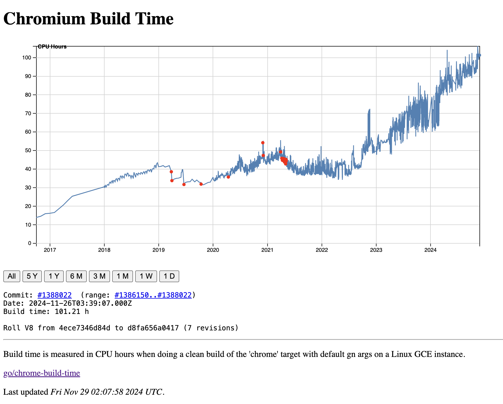
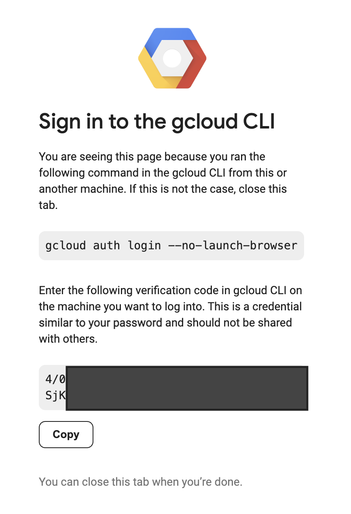
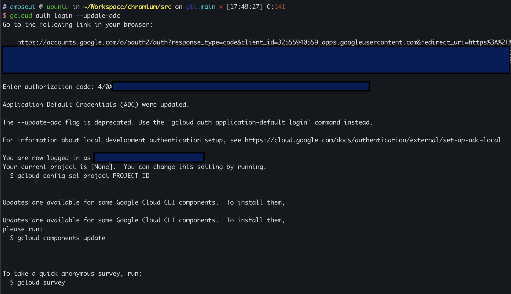
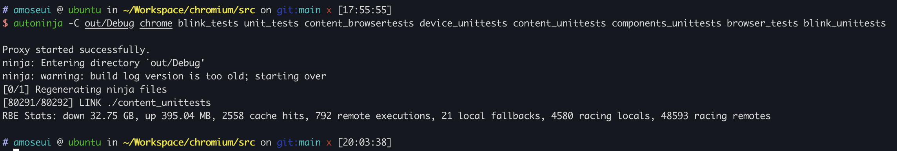

Chromium 의 빠른 빌드를 위한 환경 셋업 방법을 정리해 보았다.

Chromium 빌드는 굉장히 오래 걸린다. 2018년에 맞춘 아래 사양의 데스크톱 PC 기준으로 chrome 빌드와 blink 를 위한 기본적인 유닛테스트 빌드를 하면 4시간이 넘게 걸린다. 2018년에는 1~2시간 정도 걸렸던 것 같은데 지금은 거의 2배 이상 차이가 난다.

- AMD 라이젠 7 피나클릿지 2700X (8 core / 16 thread)
- 32GB RAM


_<center>https://commondatastorage.googleapis.com/chromium-browser-clang/build-time.html</center>_

Chromium 팀에서 측정 중인 Chromium Build Time 그래프에서 2018년과 2024년을 비교해도 거의 3배 차이가 난다.

Chromium 빌드 가이드에는 빌드를 빨리 할 수 있는 방법을 여러가지 제공하고 있다.

먼저 구글 개발자를 위한 별도의 가이드가 있다. 내부 리모트 서버를 사용하는 방법이 있는 것 같은데 외부 개발자는 가이드조차 볼 수 없어서 실제로 어떻게 사용하는지, 얼마나 빨라지는지 알 수 없다. 대신 외부 개발자를 위한 [Faster builds](~https://chromium.googlesource.com/chromium/src/+/main/docs/linux/build_instructions.md#Faster-builds~) 가이드가 따로 있다. Reclient 권한을 받으면 리모트 캐시 빌드를 할 수 있다. 가이드 상으로 tryjob access 가 있는 개발자라면 별도의 신청으로 권한을 얻을 수 있다. 하지만 내가 권한 요청을 했을 때는 committer 인지 확인을 했다. 구글에서 비용을 쓰는 것이다보니 아무나 해주는 것 같진 않았다. 다행히 committer 가 된 후에 신청을 했기 때문에 받아주었다.

리모트 빌드는 `Bazel` 의 [remote-apis](https://github.com/bazelbuild/remote-apis) 기반으로 [reclient](https://github.com/bazelbuild/reclient) 를 클라이언트로 사용한다. 백엔드는 구글내 클라우드 서버에서 돌고 있는데 가이드에는 `RBE` 라고만 되어있고 별다른 설명은 없다. 직접 `remote-apis` 서버를 구축해서 사용할 수도 있다고 한다. 업무로 chromium 프로젝트를 한다면 한 번 깊게 알아볼 것 같다.

## 빌드 방법

먼저 구글 클라우드 계정 등록이 필요하다.

1. [gcloud CLI 설치](https://cloud.google.com/sdk/docs/install)
2. gcloud 로그인 실행

```bash
$ gcloud auth login --update-adc
```

3. 생성된 링크를 웹브라우저로 복사, verification code 복사
   
   
4. `Enter authorization code` 에 복사한 verification code 붙여넣기

5. chromium/.gclient 파일 수정 - `custom_vars` 내 `"rbe_instance": "projects/rbe-chromium-untrusted/instances/default_instance",` 추가

```
solutions = [
  {
    "name": "src",
    "url": "https://chromium.googlesource.com/chromium/src.git",
    "managed": False,
    "custom_deps": {},
    "custom_vars": {
      # This is the correct instance name for using Chromium's RBE service.
      # You can only use it if you were granted access to it. If you use your
      # own REAPI-compatible backend, you will need to change this accordingly
      # to its requirements.
      "rbe_instance": "projects/rbe-chromium-untrusted/instances/default_instance",
    },
  },
]
```

6. gclient sync 실행

```bash
$ gclient sync
```

7. out/Debug/args.gn 에 내용 추가

```
use_remoteexec = true
reclient_cfg_dir = "../../buildtools/reclient_cfgs/linux"
```

8. 빌드 실행

```bash
$ gn gen out/Debug
$ autoninja -C out/Debug chrome blink_tests blink_unittests blink_platform_unittests
```



빌드는 스크린샷에서는 2시간 정도 걸리고 8번 명령어 기준으로는 1시간 조금 넘게 걸린다. 평소 로컬 빌드를 했을 때 4시간 이상 걸리는 것과 비교하면 꽤 빠르다. 다른 프로젝트에 비하면 1시간도 빠르다고 볼 수는 없지만 요즘 로컬 빌드 속도에 비하면 꽤 만족스러운 속도이다.

### 빌드를 빠르게 할 수 있는 기타 방법

리모트 캐시 빌드를 사용할 수 없는 경우, 빌드 옵션을 조정하여 빌드 속도를 빠르게 할 수 있다. 리모트 캐시 서버를 사용하는만큼 빨라지지는 않지만 조금은 시간을 줄일 수 있다.

1. symbol_level 조정 : level 을 낮출수록 빌드 속도가 빨라진다.

- symbol_level=2 full debug info
- symbol_level=1 stack traces, not line-by-line debugging
- symbol_level=0 no debug symbol다

2. blink, v8 symbol_level 조정 : blink, v8 debug 정보가 불필요한 경우 0으로 낮출 수 있다.

- blink_symbol_level=0
- v8_symbol_level=0

3. ccache 사용 (reclient 사용하는 경우 큰 효과 없음)

- https://chromium.googlesource.com/chromium/src/+/main/docs/linux/build_instructions.md#ccache 참고

지금은 reclient 를 사용하고 있기 때문에 위 방법은 따로 사용하고 있지 않다.
