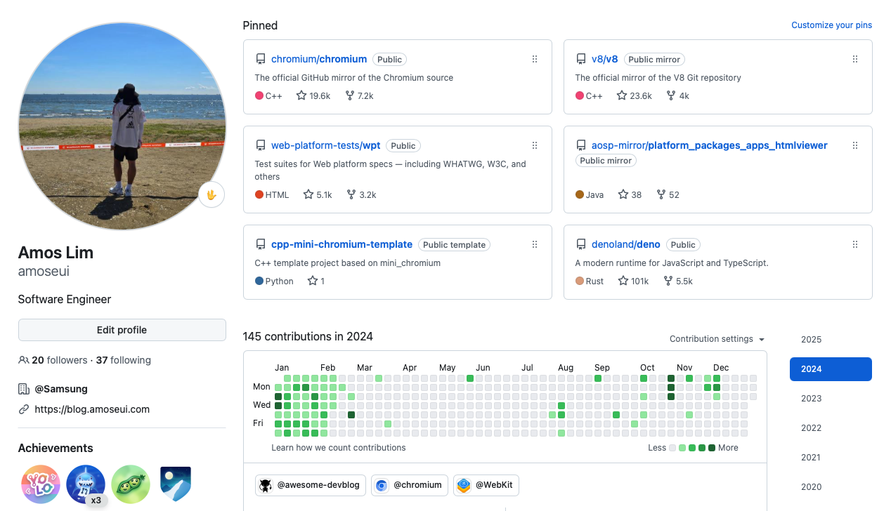
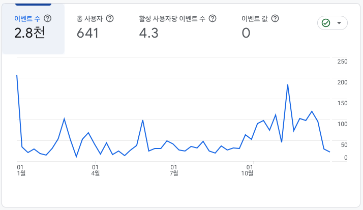
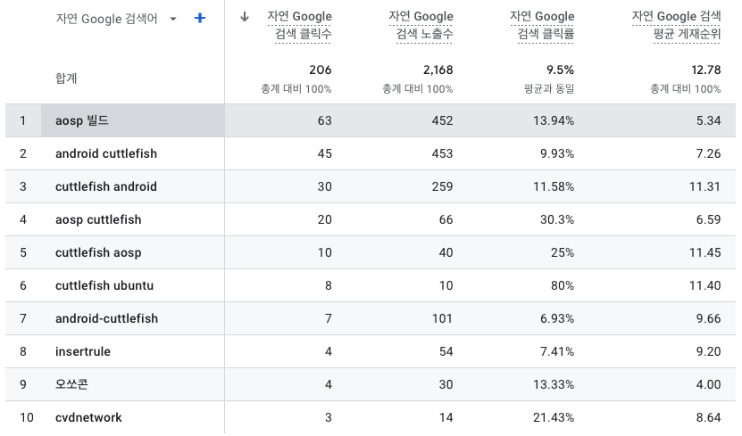

### 오픈소스

2024년의 오픈소스 목표는 세 개였다.

1. Chromium 기여를 좀 더 해서 Committer 가 되는 것
2. Chromium 외 다른 오픈소스 프로젝트에 꾸준히 기여하는 것
3. 내 프로젝트를 오픈소스 프로젝트 형식으로 개발하여 구글 플레이스토어에 출시하는 것

3월에 Chromium Committer 로 선정되면서 1번 목표를 달성했다. 자세한 후기는 [블로그 글](https://blog.amoseui.com/became-chromium-committer) 로 남겼다. 커미터가 된 후에는 컨트리뷰션을 거의 하지 않았다. 내가 앞으로도 열심히 할 것 같다고 리뷰어가 커미터로 추천을 해줬는데 미안하게 됐다. (올해는 제대로 해볼게...) 한 해동안 반영한 패치는 달랑 두 개. 그 중 하나는 1년 전에 작업이 다 끝났는데 스펙이 정리가 안 돼서 반영을 못했던 것이었다. 1년이 지나서야 정리가 돼서 rebase 를 하고 반영했다. 그 사이에 내가 만들어 놓은 WPT 테스트를 파이어폭스 쪽에서 먼저 그대로 반영해버렸다. 괜히 아쉽다.

2, 3번은 역시나 실패했다. 플레이스토어에 앱을 올려보려고 연초에 조금 끄적거리다가 말았다. 10년 넘게 매번 시작만 하고 완성을 못하고 있다. 작게라도 완성하는 습관을 들이는게 목표이다.

2년 째 오픈 프런티어 기여형 프로그램에 참여하면서 어느 정도 강제적으로 오픈소스 활동을 했었다. 2025년에는 기여형 프로그램이 없어지고 멘토형 프로그램만 남는다고 들었다. 멘토링도 관심은 있지만 Chromium 프로젝트로 멘토링을 하기에는 아직 많이 부족하다고 생각한다. 나중에 다시 업무로 웹브라우저를 하게 되면 도전해볼 생각이다.

#### 2025년 오픈소스 목표

1. 오픈소스로 개발한 앱 구글 플레이스토어 출시
2. Chromium Feature 구현 및 배포 3회 이상

앱 출시는 올해 우선순위가 가장 높은 목표이다. 앱의 퀄리티도 중요하지만 간단한 앱으로 과정과 데이터를 보는 것에 집중해보려고 한다.

올해도 Chromium 프로젝트에 기여 할 생각이다. 커미터 달고 먹튀한 느낌도 있어서 의무감에 하려는 목적도 있다. 언젠가 웹브라우저를 업무로 다시 할 수도 있고... 어쨌든 오픈소스 기여는 꾸준함이 생명이기 때문에 놓지 않는 것이 중요하다. 쉬면 다시 시작하기 어렵다.

_
항상 연초에만 매일 하다가... 흐지부지
_

### 컨퍼런스/세미나/멘토링

#### 참석한 컨퍼런스/세미나

- 2024-07-20 I/O Extended Android in Korea 2024 [후기](https://blog.amoseui.com/2024-gdg-google-io-extended)
- 2024-07-27 I/O Extended 2024 Incheon [후기](https://blog.amoseui.com/2024-gdg-google-io-extended)
- 2024-10-12 DEVCON 2024
- 2024-11-16 Open Source Conference (오쏘콘) [발표 후기](https://blog.amoseui.com/opensourceconference)
- 2024-12-11 솔로프리너 컨퍼런스: 1인 개발자, 인디해커의 삶
- 2024-12-21 au VimEnter \* call Bye2024()

코로나 이후로 컨퍼런스를 전혀 가지 않다가 2024년에는 6개에 다녀왔다. 오쏘콘에서 발표도 했다. 재미있었던 건 VimEnter, 인상 깊었던 건 솔로프리너 컨퍼런스였다. 두 개는 후기를 따로 남기지 못했다. 컨퍼런스 후기 쓰는 건 왜 이리 귀찮은지. GDG I/O Extended 나 데브콘은 실제로 적용할 수 있거나 지식적으로 큰 도움이 되는 세션이 많진 않았지만 (보통 나의 업무와 핏되는 내용이 잘 없음) 에너지를 얻고 동기 부여를 받는데 도움이 됐다.

2025년에도 컨퍼런스를 많이 다닐지는 모르겠다. 오쏘콘이 이번에 처음 열렸는데 2025년에 또 열리면 참석할지도.(발표는 안 할 듯..) VimEnter 는 앞으로 매년 가고 싶다.

#### 멘토링

모교 졸업 프로젝트 두 팀을 멘토링했다. A팀 3회, B팀 2회 zoom 으로 진행했으며 B팀은 아직 프로젝트 진행 중이라 1학기에 또 진행할 예정이다. 솔직히 형식적인 목적이 더 크고 멘토와 멘티 간 주제 매칭이 100% 가 되기 어려워서 기술적인 조언을 주기에 한계가 있다. 그렇다면 다른 도움이라도 되면 좋을텐데 세대 차이도 너무 나고 이제는 졸업한지 너무 오래돼서 취업 관련 조언을 주기도 어렵다. 서로에 대한 이해가 없는 것이나 다름 없어서 더 어렵기도 하다. A팀 멘토링을 할 때는 한 번 자료를 만들어서 내 커리어 소개를 하기도 했다. (별 반응은 없었지만...) 이런 형식적인 멘토링에 한계를 느껴서 아예 강연을 하는게 나을 것 같다는 생각도 했다. 어쨌든 멘토링을 하는 건 조심스러운 부분도 있지만 내 입장에서는 나를 돌아보고 정리하는데 도움이 된다. 회사에서도 가끔 중고등학생이나 대학생 대상으로 진행하는 멘토링 프로그램의 멘토 신청을 받는데 나중에 한 번 지원해 볼 생각이다.

### 블로그

- 2024-01-02 [2023년 회고 그리고 2024년](https://blog.amoseui.com/2023-retrospective)
- 2024-05-26 [Chromium Committer 가 되었다](https://blog.amoseui.com/became-chromium-committer)
- 2024-10-06 [2024 GDG Google I/O Extended 간단 후기](https://blog.amoseui.com/2024-gdg-google-io-extended)
- 2024-11-25 [오쏘콘(Open Source Conference) 발표 후기](https://blog.amoseui.com/opensourceconference)
- 2024-11-30 [Chromium Faster Build 방법](https://blog.amoseui.com/chromium-faster-build)

2024년에는 5개의 글을 올렸다. Chromium Committer 가 된 과정과 오쏘콘 발표 후기를 꽤 공을 들여서 썼다. 꽤 오랫동안 오픈소스 활동을 해서 결국 하나의 마일스톤을 찍고, 발표까지 한 건 나름대로 큰 성과였다. 그리고 블로그에 글까지 남기다니... 내 자신 많이 발전했다.

조회수는 여전히 소소하다. 인기가 있는 주제의 글도 딱히 없고 글 수도 적다. 앞으로 양질의 글을 꾸준히 올리고 싶다. 간단히 공부한 내용이나 튜토리얼 성격의 글은 티스토리 같은 별도의 블로그에 올리고 이 쪽에는 좀 더 퀄리티 있는 글을 올려서 보정을 할 생각이다.

#### 조회수 순위

1. [Android 13 AOSP 빌드 및 cuttlefish 실행](https://blog.amoseui.com/android-13-aosp-cuttlefish)
2. [Chromium Committer 가 되었다](https://blog.amoseui.com/became-chromium-committer)
3. [2023년 회고 그리고 2024년](https://blog.amoseui.com/2023-retrospective)
4. [오쏘콘(Open Source Conference) 발표 후기](https://blog.amoseui.com/opensourceconference)
5. [cpp-mini-chromium-template 프로젝트 소개](https://blog.amoseui.com/cpp-mini-chromium-template)

검색어 유입은 여전히 aosp 빌드와 cuttlefish 가 대부분이다. 검색이 잘 될 만한 글을 올려서 테스트해보고 싶은데 어떤 글을 올려야 될지 모르겠다. 검색어나 유입 경로에 대한 데이터는 궁금해서 한 번씩 보게 된다. 한 달 전에 [awesome-devlog](https://github.com/awesome-devblog/awesome-devblog) 에 블로그를 등록해 놓았는데 이를 통한 유입이 어느 정도 있을지도 궁금하다. (등록 후 이 글이 첫 번째) 조회수는 높으면 좋겠는데 지인은 딱히 안 봤으면 좋겠다. ㅎㅎ

### 회사

새로운 업무를 하면서 앞으로의 커리어에 대한 고민과 의문이 더 커졌다. 개발을 하면서 소프트웨어 엔지니어링을 같이 고려하는 걸 좋아하는데 그런게 전혀 필요없는, 단기적인 결과만 있으면 되는 휘발성 업무, 프로젝트가 많았다. 커리어 측면에서 남는 게 별로 없었다. 다른 방식으로 일을 하면서 배운 것도 당연히 있지만 이 업무를 오래 하는게 과연 장기적으로 도움이 되는 것인지 의문이 생겼다. 대신 내가 어떤 걸 좋아하는지, 어떤 걸 힘들어하고 스트레스 받는지 조금 더 명확하게 알 수 있었다.

### 2025년

2024년의 목표는 `Pay Off` 였다. 밀린 부채를 갚는 것. 만족스럽지는 않지만 절반은 성공했다고 생각한다. 예전부터 되고 싶었던 Chromium Committer 가 됐고 회사 컨퍼런스가 아닌 자의로 처음 컨퍼런스 발표를 했다. 못 갚은 부채는 아직도 많다.

요즘 느끼는 건 결국은 꾸준함이 중요하다는 것이다. 이제는 꾸준하게 쌓은 누적 스탯으로 커리어를 이어나가야 할 때이다. 그런데 나는 커리어를 시작한 지 10년이 넘은 지금도 방향을 못 잡고 방황 중인 것만 같다. 그동안 쌓은 누적 스탯을 폭발시키기 위해 방향을 다시 잡고 루틴을 만들고 프로세스를 만들어 시스템화해야 한다. 최근 느낀 나의 문제는 목표가 없고 정리가 되어있지 않으면 아무 것도 안한다는 것이다. 꾸준히 정리하고 개선하기 위한 의식적인 훈련이 필요하다. 목표를 세우고 쳇바퀴를 만들자. 직접 구르면서 목표를 달성하자.

추가로 AI 에 대한 관심과 공부, 직접적인 활용을 좀 더 적극적으로 하려고 한다. 회사에서 다 막아 놓아서 사용할 수 있는 도구가 거의 없지만 그 핑계로 아무 것도 안 할 수는 없다. 뒤쳐지면 안 된다.
