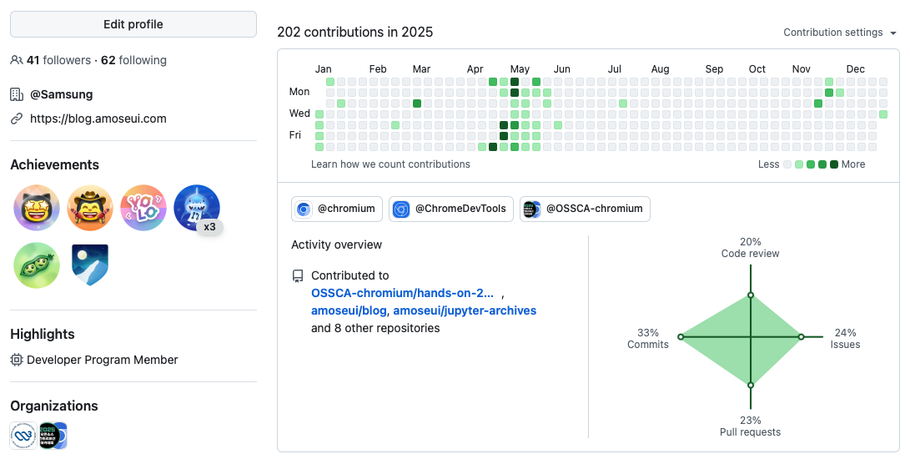
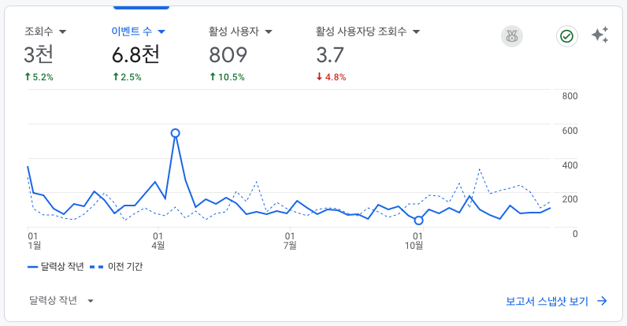
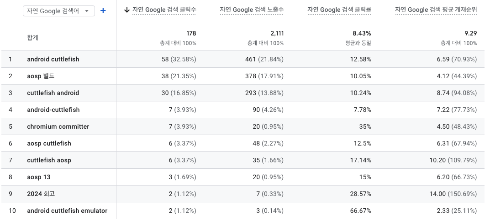
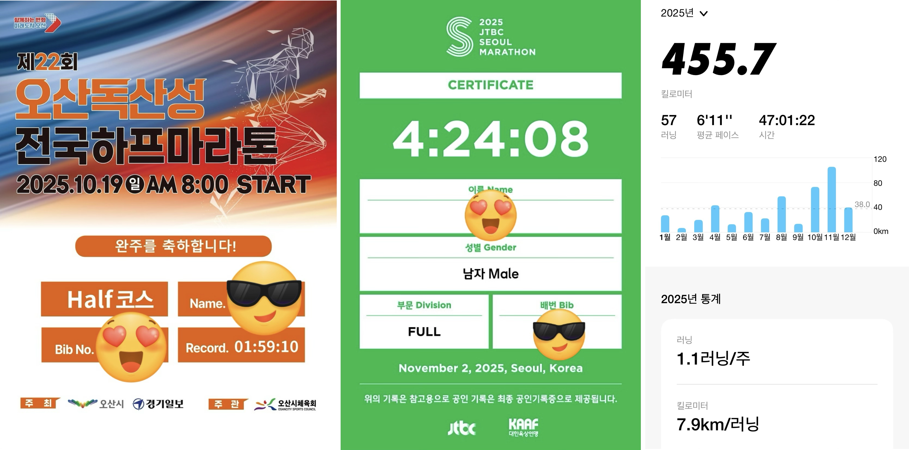

조금 늦게 남겨 보는 2025년 회고와 2026년.

[2024년 회고](https://blog.amoseui.com/2024-retrospective)와 동일하게 오픈소스, 컨퍼런스/세미나/멘토링, 블로그, 회사에 대해 각각 회고를 남겨보았고, 이번에는 개인 항목까지 추가했다.

## 오픈소스

2025년 오픈소스 목표는 아래와 같았다.

1. 오픈소스로 개발한 앱 구글 플레이스토어 출시
2. Chromium Feature 구현 및 배포 3회 이상

앱 개발과 출시는 올해도 실패. Chromium 기여는 OSSCA 멘토링을 위해 오타 수정 패치만 반영했다. 예전부터 개발해 보려고 노리던 feature 는 구글 쪽에서 진행하겠다고 댓글이 달려서 포기했다. 현재 업무도 너무 달라서 더 시간을 내기가 어려워진 것 같다.

연초부터 바이브 코딩이 유행하기 시작하고 코딩 에이전트들이 경쟁적으로 발전하면서 개발자들의 생산성이 급격하게 올라갔다. 자기계발과 개인 프로젝트에 대한 방향을 잡기가 어려웠다. 예전에는 다른 사람들과 함께 프로젝트를 해봐야겠다는 생각을 많이 했는데 이제는 토이 프로젝트를 남들과 할 생각을 아예 안하게 됐다. 대신 AI 도구를 최대한 많이 써서 최대한 많은 프로덕트를 최대한 빠르게 출시하는 걸 목표로 하게 됐다. 옛날부터 프로젝트를 시작만 하고 끝을 못 내는 일이 비일비재했는데 올해는 꼭 프로젝트 완성이라는 목표를 달성하겠다. 도구를 잘 쓰기 위한 지속적인 훈련도

## 컨퍼런스/세미나/멘토링

### 참석한 컨퍼런스/세미나

- 2025-05-29 Browser Night #1 [발표 자료](https://speakerdeck.com/amoseui/opeunsoseu-keonteuribyusyeon-akademi-hugi)
- 2025-09-11 2025 OSSCA 멘토단 오픈라운지 NIGHT

2024년에 비해서는 컨퍼런스나 세미나를 거의 가지 않았다. 그나마 갔던 두 개는 모두 OSSCA 멘토링과 관련된 것이었다.

5월 말에 Browser Night 이라는 웹브라우저 개발자 밋업이 처음으로 열렸다. 마침 OSSCA 멘토링이 끝나는 시점이었어서 멘토링 후기 주제로 라이트닝톡 신청을 했다. 멘티들도 몇 명 같이 참석했다. 준비를 나름 해갔는데 분량 조절 실패로 룰에 따라 5분이 되자마자 강판당했다. 발표를 제대로 못한 아쉬움은 있었지만 우리나라에서 실력있는 웹브라우저 개발자들은 다 모였던 너무 뜻깊은 시간이었다.

9월에는 OSSCA 주최 측에서 멘토단 모임을 해주셨다. 2025년 체험형, 참여형 멘토님들과 네트워킹 시간을 가졌다. 생각보다 많은 대화를 나누고 실력있는 분들께 좋은 인사이트를 얻을 수 있었다.

### 멘토링

위에서 여러번 언급했듯이 지난 4월부터 6주 동안 2025 오픈소스 컨트리뷰션 아카데미(OSSCA) 체험형 프로그램 멘토를 했다. 개인적으로 2025년의 가장 큰 이벤트였다. 자세한 후기는 [블로그 글](https://blog.amoseui.com/ossca-2025-chromium)로 따로 남겼다.

모교에서 교수님 요청으로 재학생 대상으로 오픈소스 기여와 커리어 성장이라는 주제로 간단히 발표를 했다. 재학생 졸업 프로젝트 멘토링도 작년에 이어서 하나 했다. AI시대가 되면서 멘토링이 더 어려워졌다.

## 블로그

- 2025-01-04 [2024년 회고](https://blog.amoseui.com/2024-retrospective)
- 2025-12-31 [2025 오픈소스 컨트리뷰션 아카데미 체험형 멘토 후기](https://blog.amoseui.com/ossca-2025-chromium)

2024년 회고 글과 멘토링 후기 글 하나를 남겼다. 회고 글을 빼면 사실상 하나 밖에 안 쓴 셈. OSSCA 멘토 후기는 5월 말에 프로그램이 끝나자마자 썼었는데 그 이후로 마무리를 못하다가 2025년 마지막 날에서야 올렸다.

조회수는 작년보다 조금 늘었지만 여전히 적다.

### 조회수 순위

1. [Android 13 AOSP 빌드 및 cuttlefish 실행](https://blog.amoseui.com/android-13-aosp-cuttlefish)
2. [Chromium Faster Build 방법](https://blog.amoseui.com/chromium-faster-build)
3. [Chromium Committer 가 되었다](https://blog.amoseui.com/became-chromium-committer)
4. [cpp-mini-chromium-template 프로젝트 소개](https://blog.amoseui.com/cpp-mini-chromium-template)
5. [2024 GDG Google I/O Extended 간단 후기](https://blog.amoseui.com/2024-gdg-google-io-extended)

조회수와 검색어 순위는 작년과 큰 차이는 없다. 정보성 글을 하나도 올리지 않았기 때문.

## 회사

10년이 넘게 회사를 다니면서 한 번도 해본 적이 없는 일을 했다. 굳이 따지자면 임베디드 소프트웨어 개발을 했다. 여전히 하드웨어 베이스의 선행 제품의 기획과 검토를 하고 PoC 제품을 만드는 일을 하고 있다. 이번에는 운이 좋게도 내가 메인으로 참여했던 프로젝트를 상품화 팀에 이관하는 걸로 결정됐다. 이 프로젝트를 하는 동안 새로운 경험도 많이 했다. 많이 높은 분들을 대상으로 하는 중요한 보고 자리에도 참석해 봤다. 사실 몇 년 뒤 이 프로젝트가 실제로 제품으로 출시가 될 수 있을지는 의문이다. 작은 부서에서 PoC 를 한 정도이고 실제 상품화를 위해선 해야 될 일이 너무 많다. 실제 개발을 해야 되는 쪽에서는 우리가 책임없는 쾌락을 즐겼다고 느낄 수도 있다. 죄송한 마음도 있지만 위에서 시켜서 했을 뿐이라는 자기 합리화를 하게 된다. 여러 한계가 있는 상황에서 나름대로 최선을 다 했다.

문제는 올해도 비슷하게 흘러갈 것 같다는 점이다. 다른 프로젝트를 하겠지만 이번에도 임베디드 개발을 할 것 같고 AI 기능도 개발해야 되는 상황이다. 작년에 내가 어떤 걸 좋아하는지, 어떤 걸 힘들어하고 스트레스 받는지 조금 더 명확하게 알 수 있었다고 했었는데 1년 동안 그 생각이 좀 더 굳혀졌다. 쉽지 않을 것 같다.

## 개인

2025년 가장 큰 성취, 풀코스 마라톤 완주. 연초에 신청을 해서 대회까지 10개월 가까운 시간이 있었지만 사실 준비를 제대로 하지 않았다. 풀코스를 1년 동안 준비하기 위해 봄에 10km, 하프 대회도 많이 신청했지만 다 안 갔다. 너무 큰 목표, 길고 긴 10개월의 시간 때문인지 더 게을러졌다. 대회가 다가올수록 풀코스라는 막연함과 두려움 때문에 오히려 더 뛰지 않게 됐다. 풀코스를 준비하는데 필수라는 30km LSD 훈련과 꾸준한 월 100-200km 마일리지 러닝은 하나도 하지 않았다. 하프마라톤 대회 하나 나가고 그 전 후로 급하게 20km 몇 번 뛰어본 게 다였다.

대회 당일, 어떻게든 되겠지라는 근거없는 자신감으로 출발했다. 어쨌든 나중에 퍼질텐데 처음에는 최대한 오버페이스하고 뒤에는 페이스가 좀 떨어져도 어떻게든 서브4는 되지 않겠나? 라는 오만한 생각. 그리고 30km가 되자마자 귀신같이 햄스트링이 올라왔다. 훈련을 제대로 하지 않으면 30km에서 고비가 온다고 했는데 영상이나 글로 봤던 그대로였다. 이렇게나 정직하다고? 파스 뿌리고 에너지젤 먹으며 겨우겨우 버티다가 35km부터는 도저히 안되겠어서 아예 뛰지 못하고 걸었다. 나중에 계산해보니 1시간 넘게 걸었더라. 주변 사람들은 그렇게 걸은 것 치고 4시간 25분이면 엄청 잘 한거 아니냐고 말한다. 그것도 틀린 말은 아니다. 하지만 아쉽다. 처음부터 끝까지 걷지 않고 뛰고 싶어졌다. 걸으면서 다짐했다. 내년에 다시 도전한다.

2025년에는 운동도 많이 했지만 정신 건강에도 신경을 많이 썼다. 나를 알기 위해 다양한 방법으로 노력했다. 사람들을 만나면서 깨닫게 된 점들도 많다. 아직 건강하지 못한 것 같다. 2026년에는 단단해지고 싶다.

## 2026년

2025년은 소프트웨어 업계에 큰 변화가 있었던 해였다. 지금까지 구글링과 스택오버플로우와 삽질로 쌓아온 나의 노하우는 LLM 앞에서 아무 것도 아니게 됐다. 내가 잘한다고 생각했던 것은 더 이상 나의 무기가 아니다. 소프트웨어 개발자로서 나의 역할은 무엇일까? 나는 아직 AI 도구 활용이 미흡하다. 좀 더 훈련을 해서 나만의 스킬, 도구로서 체화해야 된다. 회사에서 쓸 수 있는 툴은 한정적이고 사내에서 개발한 AI 서비스를 사용하도록 한다. AX 조직까지 만들었다. 그런 한계를 두지 말고 알아서 해야지. 내가 아는 것이, 경험한 것이 이제 아무 것도 아닐 수 있다. 내가 알아, 이거 해 봤어에 대한 의미가 크게 없어지고 있다. 그래서 정말 프로덕트를 만들어보는 실험을 해봐야 한다.

> 추가로 AI 에 대한 관심과 공부, 직접적인 활용을 좀 더 적극적으로 하려고 한다. 회사에서 다 막아 놓아서 사용할 수 있는 도구가 거의 없지만 그 핑계로 아무 것도 안 할 수는 없다. 뒤쳐지면 안 된다.

1년 전 회고에 썼던 말이다. 같은 마음이다.
